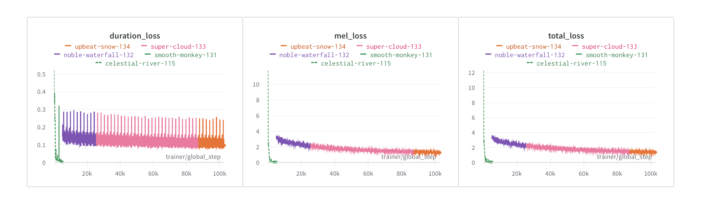

## FastSpeech TTS model

Third assignment on DLA (Deep learning in audio) HSE course.

### Train

Overfit model on one batch:

```bash
pip3 install -r requirements.txt -f https://download.pytorch.org/whl/cu113/torch_stable.html
python3 make_durations.py
python3 trainer.py fit --config config/common.yaml
```

### Loss


